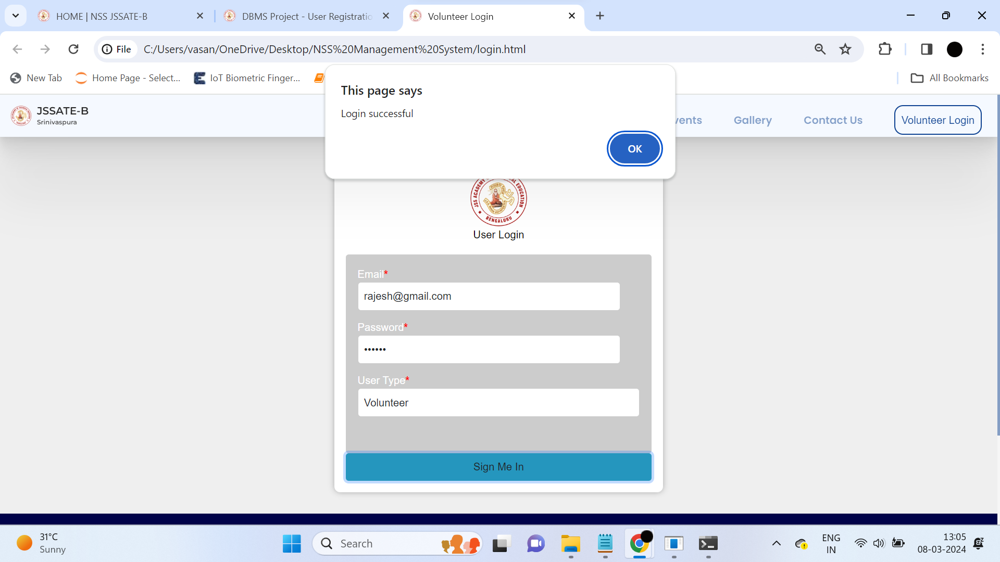
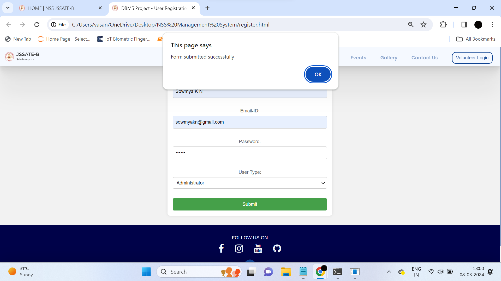

# NSS Management System

The NSS Management System is designed to modernize the management of National Service Scheme (NSS) activities in colleges. By replacing traditional paper-based processes with a digital platform, it streamlines volunteer enrollment, activity planning, attendance tracking, and performance evaluation, enhancing overall efficiency and data accuracy.

## Overview

This system offers a comprehensive solution for managing NSS activities with features tailored to meet the needs of both administrators and volunteers. Users can register by providing their personal details, and their information is securely stored in the database. User authentication ensures that only authorized individuals can access the system, protecting sensitive data and maintaining privacy. Administrators have the capability to monitor and manage volunteer activities, track attendance, and evaluate performance. This digital approach not only improves operational efficiency but also enhances the overall experience for volunteers and administrators alike.

### Key Functionalities

1. **User Registration and Authentication**:
   - Volunteers can sign up by entering their personal information, such as name, contact details, and NSS-related details.
   - The system includes a secure authentication mechanism, allowing users to log in using their credentials. This ensures that only registered users can access the system.

2. **Volunteer Management**:
   - Administrators can view and manage the list of registered volunteers. This includes editing volunteer information and  assigning roles.
   - Volunteers can update their profiles and view their activity history.

3. **Activity Planning and Management**:
   - Administrators can create and schedule NSS activities, such as community service events, workshops, and training sessions.
   - Volunteers can view upcoming activities, enroll in events, and receive notifications about new and scheduled events.
   - Detailed descriptions and requirements for each activity are provided to ensure volunteers are well-prepared.

4. **Attendance Tracking**:
   - The system automates attendance tracking for all activities. Volunteers can check in and check out of activities using the system.
   - Administrators can view attendance records, generate attendance reports, and identify trends or issues with participation.

5. **Role-Based Access Control**:
   - The system implements role-based access control to ensure that users have access to the features relevant to their roles.
   - Volunteers have access to their profiles, activity enrollment, and performance feedback.
   - Administrators have additional privileges to manage volunteers, activities, and system settings.

By integrating these functionalities, the NSS Management System enhances the management and organization of NSS activities, making the entire process more efficient, transparent, and user-friendly.

## Screenshots

### Homepage


### Login Page


### Register Page


### Enroll Page


### Admin Page


### Activity Management


### ER Diagram


## Features

- **Volunteer Enrollment**: Digital enrollment process for volunteers, ensuring accurate and efficient data collection.
- **Activity Planning and Management**: Tools for administrators to plan, manage, and track NSS activities.
- **Attendance Tracking**: Automated attendance tracking for volunteers, ensuring accurate record-keeping.
- **Performance Evaluation**: Tools for evaluating volunteer performance and generating comprehensive reports.
- **Role-Based Access Control**: Secure access based on user roles (e.g., administrators, volunteers).

## Technologies Used

- **JSON for Data Handling**: Ensures lightweight and flexible data exchange.
- **Web Technologies**: HTML, CSS, JavaScript for the front-end.
- **Database Management**: Utilizes various tables for efficient data storage:
  - `users`
  - `volunteers`
  - `activities`
  - `attendance_tracking`

## Folder Structure

The project is structured into several key directories:

### Client

The `client` directory contains the front-end code.

- `src`: Source code for the front-end application.
  - `components`: Contains React components.
  - `App.js`: Main application component.
  - `index.js`: Entry point of the React application.
- `public`: Public assets for the application.
- `package.json`: Front-end dependencies and scripts.

### Server

The `server` directory contains the back-end code.

- `schemas`: Contains database schemas for different entities.
- `controllers`: Handles the logic for different routes.
- `server.js`: Main server file setting up Express and database connections.
- `.env`: Environment variables for the server.
- `package.json`: Back-end dependencies and scripts.

## How to Run the Project

1. **Clone the repository:**

    ```bash
    git clone https://github.com/vasanthsai14/NSS-Management-System.git
    ```

2. **Navigate to the project directory:**

    ```bash
    cd NSS-Management-System
    ```

3. **Install the dependencies for the client:**

    ```bash
    cd client
    npm install
    ```

4. **Start the client:**

    ```bash
    npm start
    ```

5. **Install the dependencies for the server:**

    ```bash
    cd ../server
    npm install
    ```

6. **Set up environment variables:**

    Create a `.env` file in the `server` directory and add the necessary variables:

    ```
    DB_CONNECTION_STRING=your_database_connection_string
    ```

7. **Start the server:**

    ```bash
    npm start
    ```

8. **Open your browser and go to:**

    ```
    http://localhost:3000
    ```

## License

This project is licensed under the MIT License.

